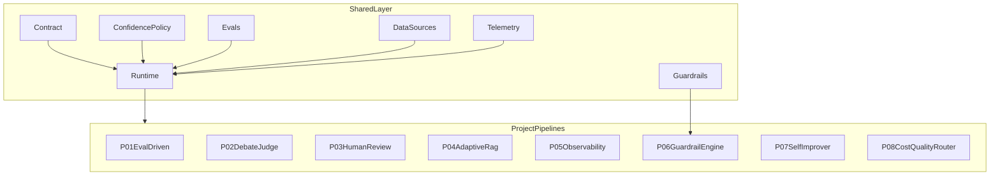

# Architecture

This monorepo implements a shared runtime for eight specialized LangGraph agent workflows.

## Key modules

- Contract: `shared/orchestration_contract/CONTRACT.md`
- Policy: `shared/orchestration_policy/policy.py`
- Data adapters: `shared/data_sources/`
- Runtime orchestration: `shared/runtime.py`
- Project dispatch: `run_project.py` + `project_pipelines/`
