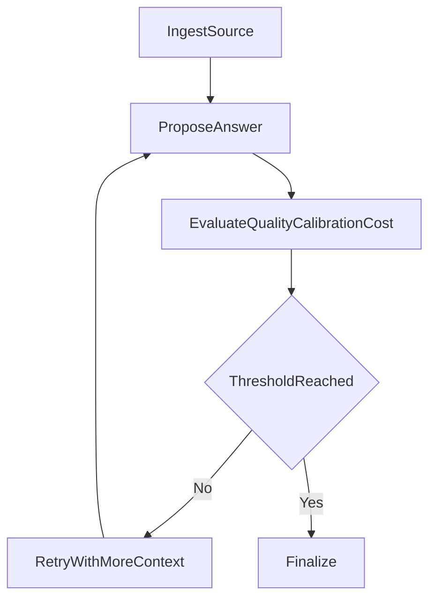

# 01-eval-driven-agent

Evaluation-driven agent for evidence-backed answer refinement.

Architecture:



Public data source:
- Wikipedia summary API

Expected outputs:
- summary/report/trace artifacts in `reports/`

Run:

```bash
python run_project.py --project 01-eval-driven-agent
```
