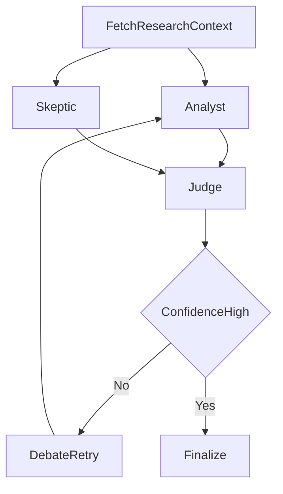

# 02-multi-agent-debate-judge

Multi-agent debate with judge-based synthesis and confidence scoring.

Architecture:



Public data source:
- Semantic Scholar Graph API

Expected outputs:
- standardized summary/report/trace artifacts

Run:

```bash
python run_project.py --project 02-multi-agent-debate-judge
```
