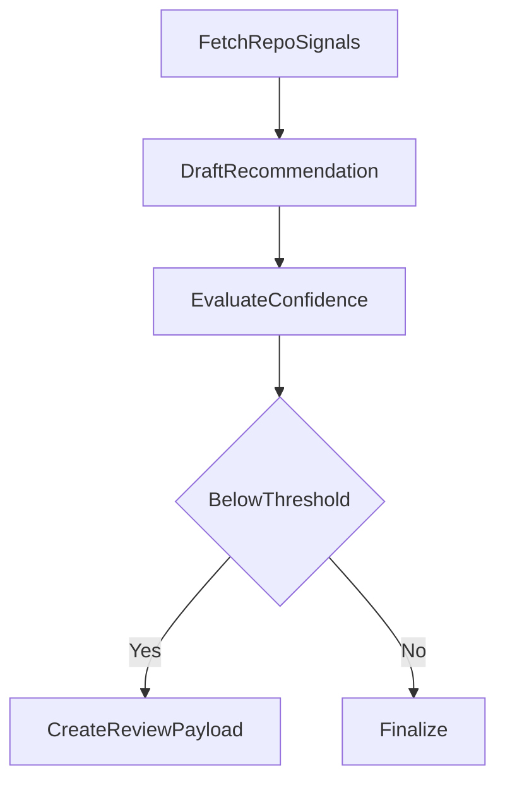

# 03-human-in-the-loop-review

Human-in-the-loop workflow with escalation and resume-ready outputs.

Architecture:



Public data source:
- GitHub repository public API

Expected outputs:
- standard artifacts + `review-payload.json`

Run:

```bash
python run_project.py --project 03-human-in-the-loop-review
```
