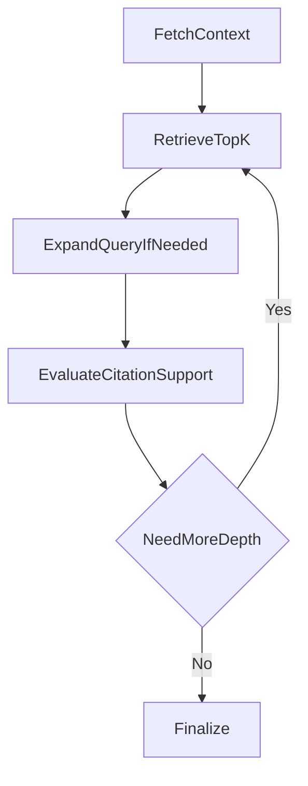

# 04-adaptive-rag-depth

Adaptive RAG depth example with dynamic retrieval effort.

Architecture:



Public data source:
- Wikipedia summary API

Expected outputs:
- standard artifacts with loop history showing depth retries

Run:

```bash
python run_project.py --project 04-adaptive-rag-depth
```
