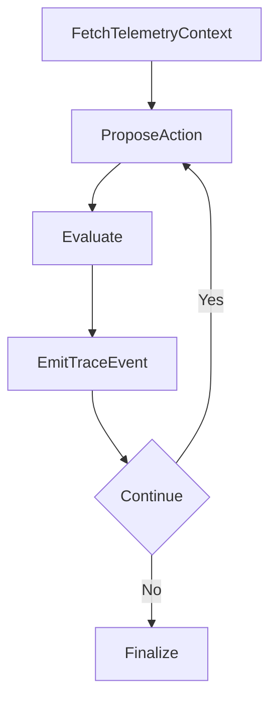

# 05-agent-observability-tracing

Observability-first agent with confidence trajectory and trace outputs.

Architecture:



Public data source:
- GitHub public API (`opentelemetry-python` metadata)

Expected outputs:
- standard artifacts with detailed trace file

Run:

```bash
python run_project.py --project 05-agent-observability-tracing
```
