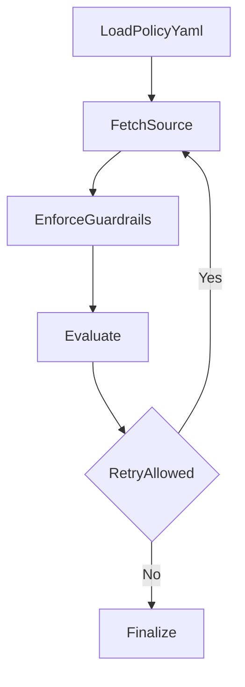

# 06-guardrail-policy-engine

Policy-guarded agent with enforceable runtime constraints.

Architecture:



Public data source:
- UCI dataset metadata API

Expected outputs:
- standard artifacts + policy-enforced answer content

Run:

```bash
python run_project.py --project 06-guardrail-policy-engine
```
