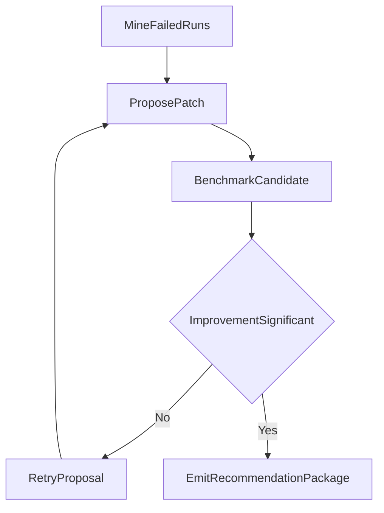

# 07-self-improving-prompt-policy-tuner

Self-improving loop that proposes and evaluates prompt policy updates.

Architecture:



Public data source:
- HuggingFace datasets API

Expected outputs:
- standard artifacts + recommendation package json

Run:

```bash
python run_project.py --project 07-self-improving-prompt-policy-tuner
```
