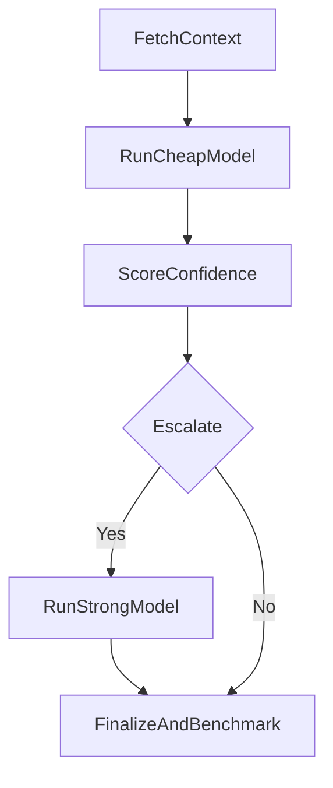

# 08-cost-quality-model-router

Cost-quality routing strategy with escalation behavior.

Architecture:



Public data source:
- Wikipedia summary API

Expected outputs:
- standard artifacts + router benchmark section

Run:

```bash
python run_project.py --project 08-cost-quality-model-router
```
